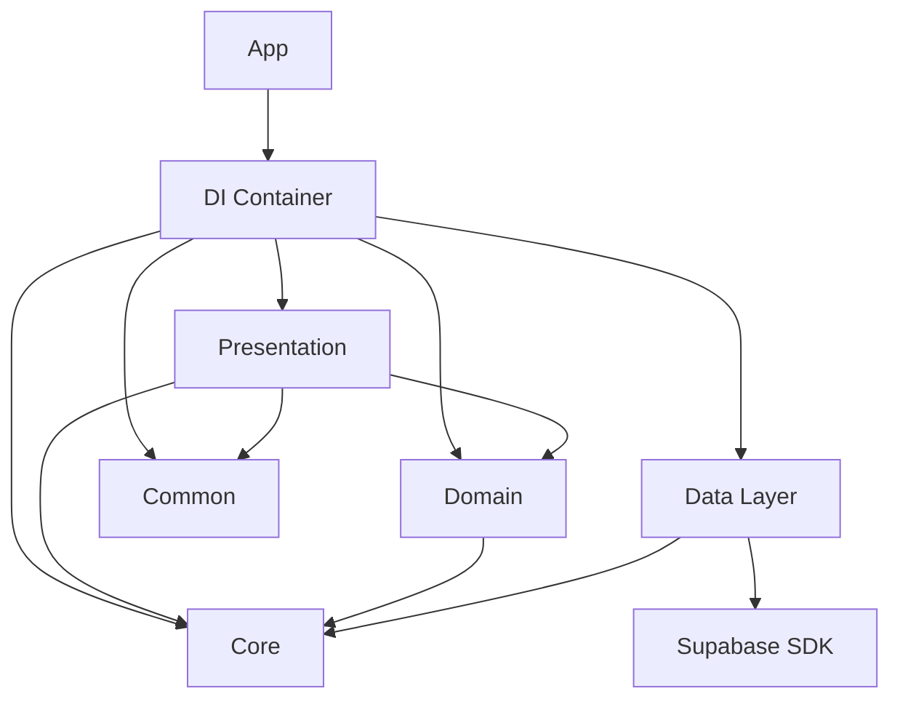

# 🏗️ Clean Architecture iOS Project

A modern iOS application built with **Clean Architecture** principles, featuring a modular design with clear separation of concerns. The project demonstrates best practices for scalable, testable, and maintainable iOS development using Swift 6 and SwiftUI.

## 📋 Table of Contents

- [Architecture Overview](#-architecture-overview)
- [Project Structure](#-project-structure)
- [Key Features](#-key-features)
- [Technology Stack](#-technology-stack)
- [Getting Started](#-getting-started)
- [Module Dependencies](#-module-dependencies)
- [Layer Responsibilities](#-layer-responsibilities)
- [Data Flow](#-data-flow)
- [Testing Strategy](#-testing-strategy)
- [Best Practices](#-best-practices)
- [Contributing](#-contributing)

## 🏛️ Architecture Overview

This project implements **Clean Architecture** (also known as Onion Architecture) with the following key principles:

- **Dependency Rule**: Dependencies only point inward. Inner layers know nothing about outer layers
- **Separation of Concerns**: Each layer has a specific responsibility
- **Testability**: Business logic is isolated and easily testable
- **Independence**: Business logic is independent of UI, Database, and external frameworks
- **Reusability**: Common UI components and utilities are shared across the application

### Architecture Diagram

```
┌─────────────────────────────────────────────────────┐
│                   Presentation                      │
│              (ViewModels, Views, UI)                │
├─────────────────────────────────────────────────────┤
│                      Common                         │
│        (Shared UI Components, Extensions)           │
├─────────────────────────────────────────────────────┤
│                      Domain                         │
│                   (Use Cases)                       │
├─────────────────────────────────────────────────────┤
│                    Data Layer                       │
│              (Repositories, DTOs)                   │
├─────────────────────────────────────────────────────┤
│                       Core                          │
│            (Entities, Protocols, Errors)            │
└─────────────────────────────────────────────────────┘

Dependencies: ↓ (only inward)
```

## 📁 Project Structure

```
Modules/
├── Common/               # Shared UI components & utilities
│   ├── Components/      # Reusable UI components
│   │   ├── CustomTextField
│   │   └── PrimaryButton
│   ├── Extensions/      # Swift & SwiftUI extensions
│   │   ├── View+Extensions
│   │   └── Date+Extensions
│   └── Styles/         # Custom styles & themes
│
├── Core/                # Business entities & contracts
│   ├── Entities/       # Business models
│   │   ├── UserEntity
│   │   └── SessionEntity
│   ├── Protocols/      # Repository interfaces
│   │   ├── AuthRepositoryProtocol
│   │   └── UserRepositoryProtocol
│   └── Errors/         # Domain errors
│       └── DomainError
│
├── Domain/             # Business logic
│   └── UseCases/       # Application use cases
│       └── Auth/       # Authentication use cases
│           ├── SignInUseCase
│           ├── SignOutUseCase
│           ├── GetCurrentUserUseCase
│           └── ObserveAuthStateUseCase
│
├── DataLayer/          # Data management
│   ├── Configuration/  # API configurations
│   │   └── SupabaseConfig
│   ├── Infrastructure/ # External services
│   │   └── SupabaseClientManager
│   ├── Repositories/   # Repository implementations
│   │   ├── AuthRepository
│   │   └── UserRepository
│   ├── DTOs/          # Data transfer objects
│   │   └── UserDTO
│   └── Mappers/       # DTO to Entity mappers
│       └── UserMapper
│
├── Presentation/       # UI layer
│   ├── ViewModels/    # Presentation logic
│   │   ├── AuthViewModel
│   │   └── UserViewModel
│   ├── Models/        # UI models
│   │   └── AlertItem
│   └── Views/         # SwiftUI Views
│       ├── ContentView
│       ├── LoginView
│       ├── HomeView
│       └── Components/
│           ├── ProfileTab
│           ├── StatsTab
│           └── SettingsTab
│
└── DI/                # Dependency injection
    └── DIContainer.swift
```

## ✨ Key Features

### Architecture Features
- **Clean Architecture**: Strict separation of concerns with dependency inversion
- **Modular Design**: Independent, testable, and reusable modules
- **SOLID Principles**: Following Single Responsibility, Open/Closed, and other SOLID principles
- **Type Safety**: Full Swift 6 concurrency with Sendable protocol

### Application Features
- **Authentication System**: Complete auth flow with Supabase integration
- **User Management**: Profile management with subscription tracking
- **Real-time Updates**: Auth state observation with async/await
- **Gamification**: XP system, levels, and streak tracking
- **Premium Features**: Subscription management with RevenueCat integration

### UI/UX Features
- **Modern UI**: Beautiful SwiftUI interface with gradients and animations
- **Reusable Components**: Common UI components library (CustomTextField, PrimaryButton)
- **Tab Navigation**: Intuitive navigation with Profile, Stats, and Settings tabs
- **Dark Mode Support**: Full dark mode compatibility
- **Loading States**: Elegant loading overlays and progress indicators
- **Error Handling**: User-friendly error alerts with AlertItem pattern

## 📱 Application Screenshots

### Authentication Flow
- **Login Screen**: Clean and modern sign-in interface with custom components
- **Loading States**: Elegant progress indicators during authentication
- **Error Handling**: User-friendly error messages with retry options

### Main Application
- **Profile Tab**: User information, stats grid, and achievement badges
- **Stats Tab**: Progress tracking, XP visualization, and leaderboards
- **Settings Tab**: Account management, preferences, and app configuration

### Key UI Features
- Custom gradients and shadows for depth
- Smooth animations and transitions
- Consistent spacing using 8-point grid
- Adaptive layouts for different screen sizes

## 🛠️ Technology Stack

- **Language**: Swift 6.2
- **UI Framework**: SwiftUI
- **Minimum iOS**: 17.0
- **Architecture**: Clean Architecture
- **Backend**: Supabase
- **Package Manager**: Swift Package Manager (SPM)
- **Concurrency**: Swift Concurrency (async/await)
- **Reactive Programming**: Combine Framework

## 🚀 Getting Started

### Prerequisites

- Xcode 16.0 or later
- iOS 17.0+ deployment target
- Swift 6.2
- Supabase account (for backend)

### Installation

1. **Clone the repository**
   ```bash
   git clone https://github.com/yourusername/your-project.git
   cd your-project
   ```

2. **Configure Supabase**
   
   Update `DataLayer/Sources/DataLayer/Configuration/SupabaseConfig.swift`:
   ```swift
   // Development
   static let url = URL(string: "your-supabase-url")!
   static let anonKey = "your-anon-key"
   ```

3. **Open in Xcode**
   ```bash
   open YourProject.xcodeproj
   ```

4. **Build and Run**
   - Select your target device/simulator
   - Press `Cmd + R` to build and run

### Local Development Setup

For local Supabase development:

```bash
# Install Supabase CLI
brew install supabase/tap/supabase

# Start Supabase locally
supabase start

# The local credentials will be:
# URL: http://127.0.0.1:54321
# Anon Key: [provided by CLI]
```

## 📦 Module Dependencies

### Dependency Graph



### Module Descriptions

| Module | Dependencies | Description |
|--------|-------------|-------------|
| **Core** | None | Contains business entities, protocols, and domain errors. The innermost layer with no dependencies. |
| **Common** | SwiftUI | Shared UI components, extensions, and utilities used across the presentation layer. |
| **Domain** | Core | Implements business logic through use cases. Contains application-specific business rules. |
| **DataLayer** | Core, Supabase | Handles data persistence, external services, and API communication. |
| **Presentation** | Core, Domain, Common | Contains ViewModels, Views, and UI-specific models. Manages UI state and user interactions. |
| **DI** | All modules | Manages dependency injection and object creation. Central configuration point for the app. |

### Module Details

#### Core Module
- **Purpose**: Define business entities and contracts
- **Key Components**: UserEntity, SessionEntity, Repository Protocols
- **Dependencies**: None (purest layer)

#### Common Module
- **Purpose**: Provide reusable UI components and utilities
- **Key Components**: 
  - CustomTextField: Styled text input component
  - PrimaryButton: Consistent button styling with loading states
  - View Extensions: Custom corner radius and UI helpers
  - Date Extensions: Formatting utilities
- **Dependencies**: SwiftUI only

#### Domain Module
- **Purpose**: Encapsulate business logic
- **Key Components**: 
  - SignInUseCase: Authentication logic
  - SignOutUseCase: Session termination
  - GetCurrentUserUseCase: User retrieval
  - ObserveAuthStateUseCase: Real-time auth monitoring
- **Dependencies**: Core

#### DataLayer Module
- **Purpose**: Implement data operations
- **Key Components**:
  - AuthRepository: Authentication implementation
  - UserRepository: User data management
  - SupabaseClientManager: External service integration
- **Dependencies**: Core, Supabase SDK

#### Presentation Module
- **Purpose**: Manage UI and user interaction
- **Key Components**:
  - AuthViewModel: Authentication state management
  - UserViewModel: User data presentation
  - Views: LoginView, HomeView, ProfileTab, StatsTab, SettingsTab
- **Dependencies**: Core, Domain, Common

## 📊 Layer Responsibilities

### Core Layer (Foundation)
- **Entities**: Pure business models (UserEntity, SessionEntity)
- **Protocols**: Repository interfaces defining contracts
- **Errors**: Domain-specific error definitions
- **Characteristics**: 
  - No external dependencies
  - Platform agnostic
  - Highly stable

### Common Layer (Shared UI)
- **UI Components**: Reusable SwiftUI components
  - CustomTextField: Consistent text input styling
  - PrimaryButton: Standard button with loading states
- **Extensions**: Swift and SwiftUI extensions
  - View modifiers and helpers
  - Date formatting utilities
  - Number formatting utilities
- **Styles**: Consistent theming and styling
- **Characteristics**:
  - SwiftUI dependent
  - Reusable across all UI
  - Promotes consistency

### Domain Layer (Business Logic)
- **Use Cases**: Encapsulates business rules
  - Authentication flows
  - User management
  - State observation
- **Business Rules**: Application-specific logic
- **Orchestration**: Coordinates between data and presentation
- **Characteristics**:
  - Platform and framework agnostic
  - Testable in isolation
  - Changes with business requirements

### Data Layer (External Communication)
- **Repository Implementations**: Concrete implementations of Core protocols
- **DTOs**: Data Transfer Objects for external communication
- **Mappers**: Convert between DTOs and Entities
- **External Service Integration**: 
  - Supabase for backend
  - RevenueCat for subscriptions
  - Network communication
- **Characteristics**:
  - Handles all I/O operations
  - Manages caching strategies
  - Deals with external APIs

### Presentation Layer (User Interface)
- **ViewModels**: Presentation logic and state management
  - AuthViewModel: Authentication state
  - UserViewModel: User data presentation
- **Views**: SwiftUI user interface components
  - LoginView: Authentication UI
  - HomeView: Main application UI
  - Tab Views: Profile, Stats, Settings
- **UI Models**: Models optimized for UI display
  - AlertItem: Alert configuration
  - Navigation state
- **Characteristics**:
  - SwiftUI and Combine based
  - Observes and reacts to state changes
  - Handles user input

## 🎨 UI Components Library

The Common module provides a rich set of reusable UI components:

### Components

#### CustomTextField
```swift
CustomTextField(
    placeholder: "Email",
    text: $email,
    isSecure: false
)
```
- Consistent styling across the app
- Support for secure text entry
- Built-in padding and background

#### PrimaryButton
```swift
PrimaryButton(
    title: "Sign In",
    isLoading: viewModel.isLoading,
    action: { await viewModel.signIn() }
)
```
- Loading state with progress indicator
- Disabled state handling
- Consistent color scheme

### Extensions

#### View Extensions
- `cornerRadius(_:corners:)`: Apply corner radius to specific corners
- Custom modifiers for consistent spacing
- Shadow and gradient helpers

#### Date Extensions
- `timeAgoDisplay`: Relative time formatting
- `shortDate`: Concise date display
- `dayOfWeek`: Day name extraction

### Design System
- **Colors**: Consistent color palette with dark mode support
- **Typography**: Standardized font sizes and weights
- **Spacing**: 8-point grid system
- **Animations**: Smooth transitions and loading states

## 🔄 Data Flow

### Sign In Flow Example

```
User Input (View) 
    ↓
AuthViewModel (Presentation)
    ↓
SignInUseCase (Domain)
    ↓
AuthRepository + UserRepository (Data)
    ↓
Supabase Client (External)
    ↓
Response mapping (DTO → Entity)
    ↓
Update ViewModel State
    ↓
UI Updates (View)
```

## 🧪 Testing Strategy

### Unit Tests

Each module includes its own test target:

```swift
// Domain Layer Test Example
class SignInUseCaseTests: XCTestCase {
    func testSignInWithValidCredentials() async throws {
        // Given
        let mockAuthRepo = MockAuthRepository()
        let mockUserRepo = MockUserRepository()
        let useCase = SignInUseCase(
            authRepository: mockAuthRepo,
            userRepository: mockUserRepo
        )
        
        // When
        let result = try await useCase.execute(
            email: "test@example.com",
            password: "password123"
        )
        
        // Then
        XCTAssertNotNil(result.user)
        XCTAssertEqual(result.user.email, "test@example.com")
    }
}
```

### Integration Tests

Test repository implementations with real backend:

```swift
class AuthRepositoryIntegrationTests: XCTestCase {
    func testRealSignIn() async throws {
        // Test with test database
    }
}
```

### UI Tests

SwiftUI snapshot tests and UI flow tests:

```swift
class AuthFlowUITests: XCTestCase {
    func testCompleteAuthFlow() throws {
        // Test complete sign in → home → sign out flow
    }
}
```

## 📐 Best Practices

### 1. Dependency Injection
Always inject dependencies rather than creating them:
```swift
// ✅ Good
class SignInUseCase {
    init(authRepository: AuthRepositoryProtocol) { }
}

// ❌ Bad
class SignInUseCase {
    init() {
        self.authRepository = AuthRepository() // Direct instantiation
    }
}
```

### 2. Protocol-Oriented Programming
Define contracts through protocols:
```swift
public protocol AuthRepositoryProtocol {
    func signIn(email: String, password: String) async throws -> SessionEntity
}
```

### 3. Reusable UI Components
Use Common components for consistency:
```swift
// ✅ Good - Using Common components
CustomTextField(placeholder: "Email", text: $email)
PrimaryButton(title: "Submit", action: submit)

// ❌ Bad - Creating custom UI each time
TextField("Email", text: $email)
    .padding()
    .background(Color.gray.opacity(0.1))
    .cornerRadius(10)
```

### 4. View Model Pattern
Separate presentation logic from views:
```swift
// ✅ Good - Logic in ViewModel
@MainActor
class AuthViewModel: ObservableObject {
    func signIn(email: String, password: String) async {
        // Handle business logic
    }
}

// ❌ Bad - Logic in View
struct LoginView: View {
    func signIn() async {
        // Business logic in view
    }
}
```

### 5. Error Handling
Use domain-specific errors and user-friendly alerts:
```swift
// Domain layer
public enum DomainError: LocalizedError {
    case invalidCredentials
    case networkError(String)
}

// Presentation layer
struct AlertItem: Identifiable {
    let title: String
    let message: String
}
```

### 6. Async/Await
Leverage Swift concurrency for asynchronous operations:
```swift
public func execute() async throws -> UserEntity {
    try await repository.fetchUser()
}
```

### 7. Sendable Compliance
Ensure thread safety with Sendable:
```swift
public final class AuthRepository: AuthRepositoryProtocol, Sendable {
    // Implementation
}
```

### 8. Modular Architecture
Keep modules focused and independent:
```swift
// Each module has a single responsibility
// Core: Entities and contracts
// Domain: Business logic
// Common: Shared UI components
// DataLayer: External communication
// Presentation: User interface
```

## 🔒 Security Considerations

- **API Keys**: Never commit API keys. Use environment variables or configuration files
- **Authentication**: Implement proper token refresh mechanisms
- **Data Validation**: Always validate input data in use cases
- **Error Messages**: Don't expose sensitive information in error messages

## 📈 Performance Optimization

- **Lazy Loading**: Load data only when needed
- **Caching**: Implement caching strategies in repositories
- **Pagination**: Use pagination for large data sets
- **Image Optimization**: Compress and cache images appropriately

## 🤝 Contributing

### Development Process

1. Fork the repository
2. Create a feature branch (`git checkout -b feature/amazing-feature`)
3. Commit your changes (`git commit -m 'Add amazing feature'`)
4. Push to the branch (`git push origin feature/amazing-feature`)
5. Open a Pull Request

### Code Style

- Follow [Swift API Design Guidelines](https://swift.org/documentation/api-design-guidelines/)
- Use SwiftLint for code consistency
- Write self-documenting code with clear naming
- Add comments for complex logic

### Commit Convention

Follow conventional commits:
- `feat:` New feature
- `fix:` Bug fix
- `docs:` Documentation changes
- `refactor:` Code refactoring
- `test:` Test additions or updates
- `chore:` Maintenance tasks

## 📄 License

This project is licensed under the MIT License - see the [LICENSE](LICENSE) file for details.

## 🙏 Acknowledgments

- [Clean Architecture by Robert C. Martin](https://blog.cleancoder.com/uncle-bob/2012/08/13/the-clean-architecture.html)
- [Supabase](https://supabase.com) for backend services
- [Swift Community](https://swift.org/community/) for best practices

## 📞 Contact

- Author: Your Name
- Email: your.email@example.com
- GitHub: [@yourusername](https://github.com/yourusername)

---

⭐ If you find this project helpful, please consider giving it a star!
